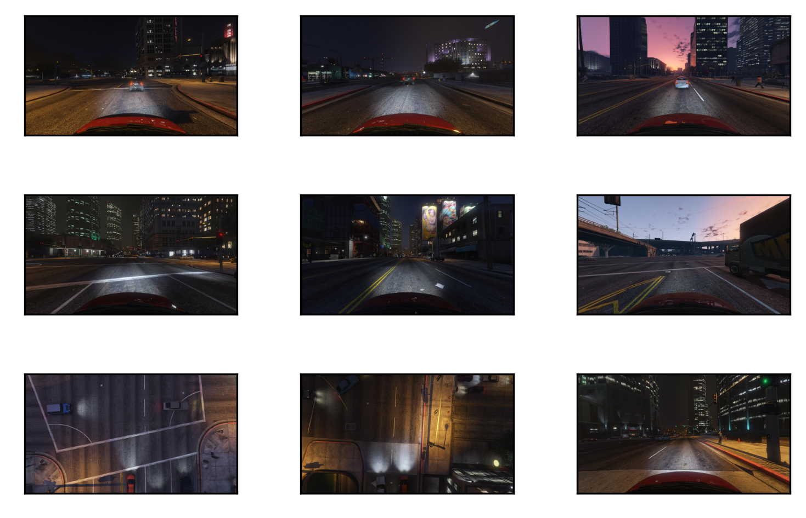

# AVCV
> Optimized functions for vision problems


```python
%load_ext autoreload
%autoreload 2
```

```python
from nbdev.showdoc import *
```

This file will become your README and also the index of your documentation.

## Install

`pip install avcv`

## How to use


<h4 id="plot_images" class="doc_header"><code>plot_images</code><a href="https://github.com/anhvth/avcv/tree/main/avcv/visualize.py#L9" class="source_link" style="float:right">[source]</a></h4>

> <code>plot_images</code>(**`images`**, **`labels`**=*`None`*, **`cls_true`**=*`None`*, **`cls_pred`**=*`None`*, **`space`**=*`(0.3, 0.3)`*, **`mxn`**=*`None`*, **`size`**=*`(5, 5)`*, **`dpi`**=*`300`*, **`max_w`**=*`1500`*, **`out_file`**=*`None`*, **`cmap`**=*`'binary'`*)


### Plot images

```python
from avcv.plot_images import plot_images
from glob import glob
import numpy as np
import mmcv
paths = glob('/data/synthetic/SHARE_SVA_DATASET/val/000/frames/*')
imgs = [mmcv.imread(path, channel_order='rgb') for path in np.random.choice(paths, 10)]
plot_images(imgs)
```

    (3, 3)





### Multi thread


<h4 id="multi_thread" class="doc_header"><code>multi_thread</code><a href="https://github.com/anhvth/avcv/tree/main/avcv/process.py#L6" class="source_link" style="float:right">[source]</a></h4>

> <code>multi_thread</code>(**`fn`**, **`array_inputs`**, **`max_workers`**=*`None`*, **`desc`**=*`'Multi-thread Pipeline'`*, **`unit`**=*`'Samples'`*, **`verbose`**=*`True`*)


```python
# example
from glob import glob
import mmcv
import numpy as np
from avcv.process import multi_thread

paths = glob('/data/synthetic/SHARE_SVA_DATASET/val/000/frames/*')
def f(x):
    return mmcv.imread(x, channel_order='rgb')
inputs = np.random.choice(paths, 1000)
fast_imgs = multi_thread(f, inputs)
slow_imgs = [f(_) for _ in inputs]
```

    Multi-thread Pipeline: 100%|██████████| 1000/1000 [00:04<00:00, 201.27Samples/s]

    Finished
    1000


    

