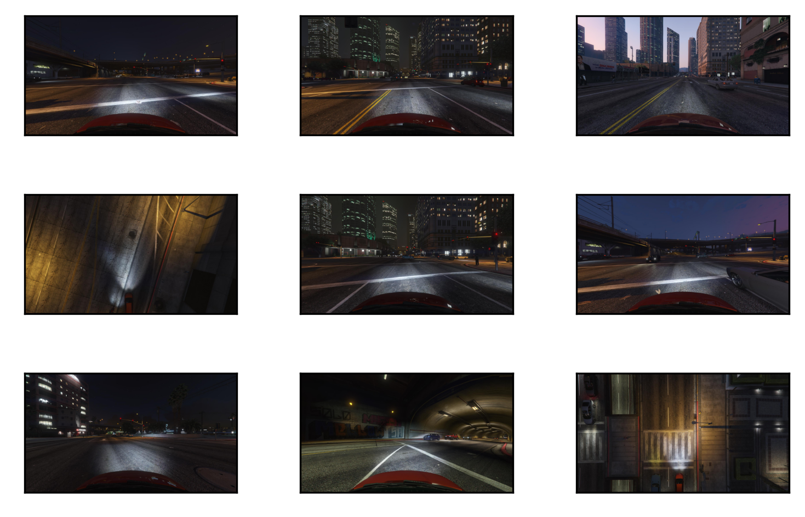

# AVCV
> Summary description here.


This file will become your README and also the index of your documentation.

## Install

`pip install avcv`

## How to use

Fill me in please! Don't forget code examples:

```python
from avcv.plot_images import plot_images
from glob import glob
import numpy as np
import mmcv
paths = glob('/data/synthetic/SHARE_SVA_DATASET/val/000/frames/*')
imgs = [mmcv.imread(path, channel_order='rgb') for path in np.random.choice(paths, 10)]
plot_images(imgs)
plot_images(images)
```

    (3, 3)





    ---------------------------------------------------------------------------

    NameError                                 Traceback (most recent call last)

    <ipython-input-5-b253384b4c57> in <module>
          6 imgs = [mmcv.imread(path, channel_order='rgb') for path in np.random.choice(paths, 10)]
          7 plot_images(imgs)
    ----> 8 plot_images(images)
    

    NameError: name 'images' is not defined

